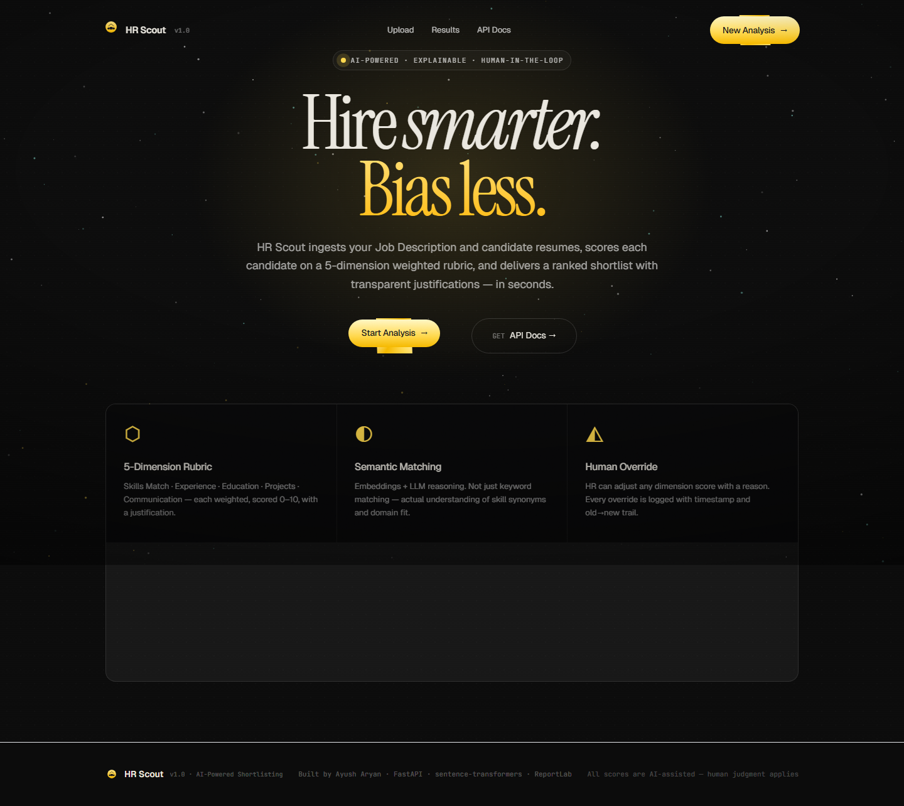
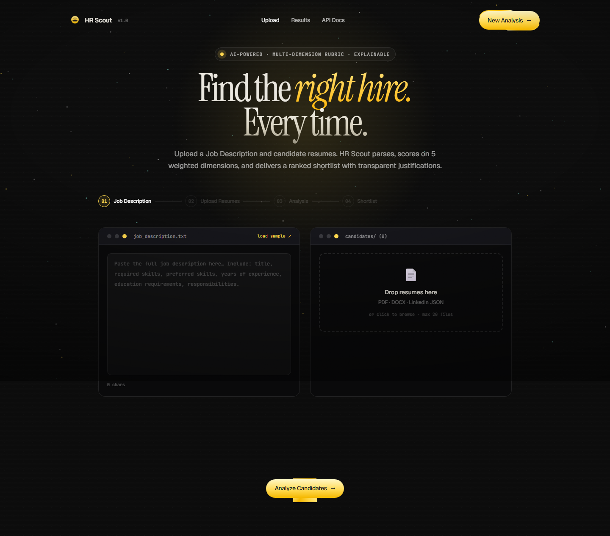
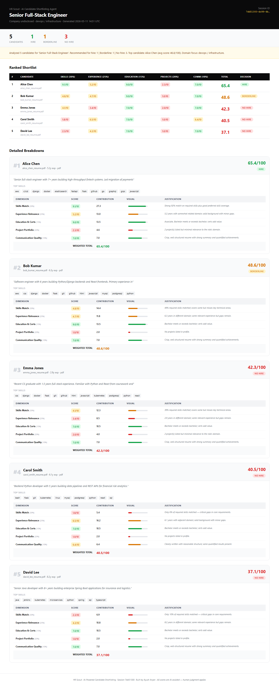
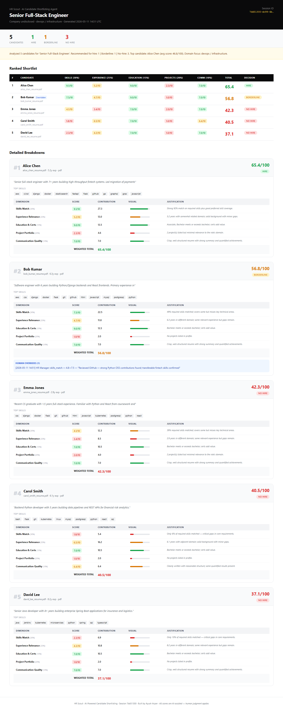
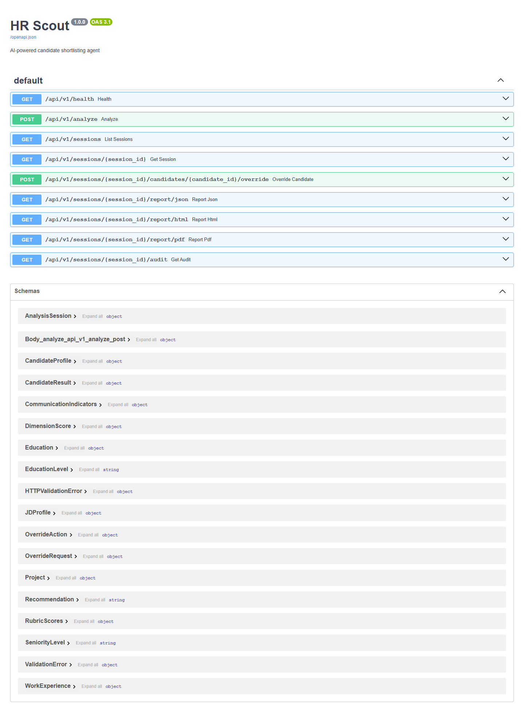

# HR Scout — AI-Powered Candidate Shortlisting Agent

> An end-to-end AI agent that ingests Job Descriptions + resumes, scores every candidate on a transparent 5-dimension weighted rubric, ranks them, and delivers shortlist reports in PDF, HTML, and JSON — with full human-override capability.

**Built by Ayush Aryan**



---

## Table of Contents
1. [Project Overview](#1-project-overview)
2. [Features](#2-features)
3. [Tech Stack](#3-tech-stack)
4. [Architecture](#4-architecture)
5. [Scoring Rubric](#5-scoring-rubric)
6. [Security Mitigations](#6-security-mitigations)
7. [Setup Instructions](#7-setup-instructions)
8. [Running the Demo](#8-running-the-demo)
9. [Sample Outputs](#9-sample-outputs)
10. [Human Override](#10-human-override)
11. [API Reference](#11-api-reference)
12. [Project Structure](#12-project-structure)
13. [Testing](#13-testing)

---

## 1. Project Overview

### The Problem
Manual CV screening is broken:
- Takes 6–8 hours per role for a talent team
- Scoring is subjective — same resume gets different scores from different reviewers
- No audit trail: decisions can't be explained or defended
- Bias creeps in through unstructured, gut-feel reviews
- No systematic way to compare 50 candidates across multiple dimensions

### The Solution
HR Scout is an AI agent that automates the screening step while keeping HR in control:

1. **Ingest** a Job Description (text or PDF)
2. **Parse** candidate resumes (PDF, DOCX, LinkedIn JSON) into structured profiles
3. **Score** each candidate on 5 weighted dimensions using semantic matching + LLM reasoning
4. **Rank** all candidates with a clear hire / borderline / no-hire recommendation
5. **Generate** a shortlist report in PDF, HTML, or JSON — ready for stakeholders
6. **Override** any score with a logged reason — keeping HR the final decision-maker

### Why It Matters
Every score has a one-line justification. Every override is timestamped and attributed. The system never makes a final hire decision — it informs one.

---

## 2. Features

| Feature | Details |
|---------|---------|
| **JD Parser** | Extracts required skills, preferred skills, experience requirements, education, certifications, domain, seniority — returns structured JSON |
| **Resume Parser** | Handles PDF (pdfplumber), DOCX (python-docx), and LinkedIn JSON exports |
| **Semantic Matching** | sentence-transformers embeddings for skill overlap — goes beyond keyword matching |
| **5-Dimension Rubric** | Skills Match · Experience Relevance · Education & Certs · Project Portfolio · Communication Quality |
| **Weighted Scoring** | Each dimension scored 0–10; weighted contributions sum to 100 |
| **One-Line Justifications** | Every dimension gets an explicit justification string |
| **Hire / Borderline / No-Hire** | Threshold-validated recommendation (≥65 hire, 45–64 borderline, <45 no-hire) |
| **Shortlist Report** | PDF, HTML, and JSON output — all three formats |
| **Human Override** | HR can adjust any dimension score with a reason; full audit log |
| **Audit Trail** | Append-only JSONL log of every pipeline action |
| **Security** | Prompt injection defense, PII masking, API key in `.env`, schema-validated LLM outputs |
| **Local Mode** | Runs entirely without an LLM API key using heuristics + embeddings |

---

## 3. Tech Stack

| Layer | Technology | Reason |
|-------|-----------|--------|
| **LLM** | Claude `claude-sonnet-4-6` (Anthropic) | Best structured JSON extraction; low hallucination rate; aligned with project tooling |
| **LLM Fallback** | GPT-4o-mini (OpenAI) | Configurable secondary option |
| **Local Mode** | Heuristic scoring + embeddings | Zero API key required; demo-ready out of the box |
| **Agent Framework** | Custom pipeline (`app/agents/pipeline.py`) | Purpose-built for this task — no hidden prompts or framework overhead |
| **Embeddings** | `all-MiniLM-L6-v2` via sentence-transformers | Local, fast, strong semantic matching; no API cost |
| **Backend** | FastAPI | Async, Pydantic-native, auto-generated Swagger docs |
| **PDF Parsing** | pdfplumber | Best text extraction quality from real-world resumes |
| **DOCX Parsing** | python-docx | Native DOCX format support |
| **PDF Reports** | ReportLab | Pure-Python, no system dependencies, fully styled |
| **HTML Reports** | Jinja2 | Clean template separation from business logic |
| **Frontend** | React 18 (CDN, single HTML file) | Zero build step; ships as one file; full SPA |
| **Storage** | JSON session files | Portable, human-readable, no database setup |
| **Secrets** | python-dotenv | Industry standard `.env` pattern |

---

## 4. Architecture

```
┌─────────────────────────────────────────────────────────────────────────┐
│                         HR Scout Pipeline                                │
│                                                                          │
│   ┌─────────────┐     ┌──────────────────┐     ┌──────────────────┐    │
│   │  JD Upload  │────▶│   JD Parser      │────▶│   JDProfile      │    │
│   │  (text/PDF) │     │  LLM + heuristic │     │  (structured)    │    │
│   └─────────────┘     └──────────────────┘     └────────┬─────────┘    │
│                                                          │              │
│   ┌─────────────┐     ┌──────────────────┐     ┌────────▼─────────┐    │
│   │   Resumes   │────▶│  Resume Parser   │────▶│ CandidateProfile │    │
│   │  PDF/DOCX   │     │  pdfplumber      │     │  (structured)    │    │
│   │  LinkedIn   │     │  python-docx     │     └────────┬─────────┘    │
│   └─────────────┘     └──────────────────┘              │              │
│                                                          ▼              │
│                              ┌───────────────────────────────────┐      │
│                              │         Scoring Engine             │      │
│                              │                                   │      │
│                              │  Skills Match       (30%)  ←──┐  │      │
│                              │  Experience Relevance (25%) ←─┤  │      │
│                              │  Education & Certs  (15%) ←──┤  │  Embeddings │
│                              │  Project Portfolio  (20%) ←──┤  │  sentence-  │
│                              │  Communication      (10%) ←──┘  │  transformers│
│                              └──────────────┬────────────────────┘      │
│                                             │                           │
│                              ┌──────────────▼────────────┐             │
│                              │       Ranking System       │             │
│                              │  Sort by weighted total    │             │
│                              │  Assign hire / borderline  │             │
│                              └──────────────┬─────────────┘            │
│                                             │                           │
│               ┌─────────────────────────────┼──────────────────────┐   │
│               │         Reports             │                       │   │
│               ▼                             ▼                       ▼   │
│       ┌──────────────┐            ┌──────────────┐       ┌──────────────┐│
│       │  JSON Report │            │  HTML Report │       │  PDF Report  ││
│       │  (Pydantic)  │            │  (Jinja2)    │       │  (ReportLab) ││
│       └──────────────┘            └──────────────┘       └──────────────┘│
│                                                                          │
│                         ┌──────────────────────┐                        │
│                         │  Human Override (HR)  │                       │
│                         │  Adjust score + reason│                       │
│                         │  Logged to audit.jsonl│                       │
│                         └──────────────────────┘                        │
└─────────────────────────────────────────────────────────────────────────┘
         ▲                                             │
         │         FastAPI REST API                    │
         │─────────────────────────────────────────────│
                   React Frontend (index.html)
```

---

## 5. Scoring Rubric

Each candidate is scored on exactly 5 dimensions. Scores are **0–10**; weighted contributions **sum to 100**.

| Dimension | Weight | Contribution | 0–3 (Poor) | 4–6 (Average) | 7–10 (Excellent) |
|-----------|--------|-------------|------------|----------------|-----------------|
| **Skills Match** | 30% | max 30 pts | <30% of required skills covered | 50–70% match | >85% match |
| **Experience Relevance** | 25% | max 25 pts | Unrelated domain/too junior | Adjacent domain | Exact domain + seniority |
| **Education & Certs** | 15% | max 15 pts | Below minimum degree | Meets requirement | Exceeds + relevant certs |
| **Project Portfolio** | 20% | max 20 pts | No projects listed | Generic projects | Strong, domain-relevant |
| **Communication Quality** | 10% | max 10 pts | Poor structure, no summary | Adequate | Crisp, structured, quantified |

**Recommendation thresholds:**
- **≥ 65** → Hire
- **45–64** → Borderline (human review recommended)
- **< 45** → No Hire

---

## 6. Security Mitigations

### Prompt Injection Prevention
- All JD and resume text passes through `app/security/sanitizer.py` before any LLM call
- 12 regex patterns neutralize `ignore previous instructions`, `forget everything`, `jailbreak`, system tag injections, etc.
- Candidate content is always passed as **data** inside clearly delimited sections — never interpolated into system instructions
- Suspicious patterns are replaced with `[FILTERED]`, preserving document integrity

### Structured Outputs & Hallucination Control
- Every LLM response is validated by a **Pydantic model** — invalid JSON is rejected
- Scores are clamped to `[0.0, 10.0]` regardless of LLM output
- `weighted_contribution` is **always recomputed** from `score × weight × 10` — LLM cannot inflate it
- Recommendation is **validated against computed total** — LLM cannot claim "hire" if score < 65
- Heuristic fallback activates automatically if LLM parse fails — system never crashes with a hallucinated result

### Data Privacy / PII
- `mask_pii()` in `sanitizer.py` masks email, phone, address in all audit logs
- Only minimum parsed fields are sent to LLM — raw resume text is not forwarded after parsing
- Local heuristic mode sends **zero data** to any external service

### API Key Handling
- All secrets stored in `.env` (excluded from git via `.gitignore`)
- `.env.example` provided with placeholder values only
- `get_settings()` uses `lru_cache` — keys read once at startup, never exposed in responses

### Unauthorized Access
- Override endpoints include `hr_user` attribution field
- `_verify_admin` HTTP Basic auth dependency available in `routes.py` (enable with `Depends(_verify_admin)`)
- File uploads capped at 10 MB per file, max 30 files per request

---

## 7. Setup Instructions

### Prerequisites
- Python 3.11+

### Install

```bash
git clone https://github.com/ayushh-aryann/hr-scout.git
cd hr-scout

# Create virtual environment
python -m venv venv
venv\Scripts\activate        # Windows
# source venv/bin/activate   # macOS/Linux

# Install dependencies
pip install -r requirements.txt

# Configure environment
copy .env.example .env       # Windows
# cp .env.example .env       # macOS/Linux

# (Optional) Add your Anthropic API key to .env for LLM-powered scoring:
# ANTHROPIC_API_KEY=sk-ant-...
# LLM_PROVIDER=anthropic
```

> **No API key needed** — the system runs fully in local heuristic mode using sentence-transformers embeddings.

---

## 8. Running the Demo

### Start the server
```bash
python main.py
# Uvicorn running on http://127.0.0.1:8000
```

### Use the UI
1. Open `http://127.0.0.1:8000` in your browser
2. Click **Start Analysis**
3. Click **"load sample ↗"** to prefill the JD
4. Upload resumes from `sample_data/resumes/` (5 PDF files included)
5. Click **Analyze Candidates** — ranked results appear in seconds
6. Expand any candidate card → **Override Score** to test human override
7. Click **PDF / HTML / JSON** to download reports

### Quick CLI demo
```bash
python -c "
import json
from pathlib import Path
from app.agents.pipeline import HRPipeline

pipeline = HRPipeline()
jd = json.loads(Path('data/sample_jd.json').read_text())['raw_text']
files = [(Path(f).read_bytes(), f.name) for f in Path('sample_data/resumes').glob('*.pdf')]
session = pipeline.analyze(jd, files)

for r in session.results:
    print(f'#{r.rank} {r.name}: {r.total_score:.1f}/100 [{r.recommendation.value}]')
"
```

### API Docs
`http://127.0.0.1:8000/docs` — interactive Swagger UI

---

## 9. Sample Outputs

### Ranking Results (5 PDF Resumes)

| Rank | Candidate | Total | Skills | Exp | Edu | Projects | Comm | Decision |
|------|-----------|-------|--------|-----|-----|----------|------|---------|
| #1 | Alice Chen | 65.4 | 9.1 | 5.2 | 9.0 | 2.3 | 7.0 | **HIRE** |
| #2 | Bob Kumar | 48.6 | 4.8 | 4.7 | 9.0 | 1.0 | 7.0 | Borderline |
| #3 | Emma Jones | 42.3 | 4.1 | 3.4 | 7.0 | 2.0 | 7.0 | No Hire |
| #4 | Carol Smith | 40.5 | 1.8 | 6.5 | 7.0 | 1.0 | 6.4 | No Hire |
| #5 | David Lee | 37.1 | 2.3 | 4.3 | 7.0 | 1.0 | 7.0 | No Hire |

Sample reports are in:
- `outputs/pdf/shortlist_report.pdf`
- `outputs/html/shortlist_report.html`
- `outputs/json/shortlist_report.json`

### Screenshots

| View | Screenshot |
|------|-----------|
| Landing / Dashboard |  |
| Upload Page |  |
| Ranking Table (HTML Report) |  |
| Score Breakdown |  |
| Override Feature |  |
| API Docs |  |

---

## 10. Human Override

HR can adjust any dimension score via the UI modal or API:

```bash
curl -X POST http://127.0.0.1:8000/api/v1/sessions/{session_id}/candidates/{candidate_id}/override \
  -H "Content-Type: application/json" \
  -d '{
    "dimension": "skills_match",
    "new_score": 7.5,
    "reason": "Reviewed GitHub profile — strong Python OSS contributions confirmed",
    "hr_user": "HR Manager",
    "flag": false
  }'
```

Every override:
- Records `old_score → new_score` with timestamp and HR username
- Recalculates `total_score` and re-ranks all candidates
- Appears in all subsequent report downloads
- Is stored in the session's `overrides[]` list — **non-destructive**

---

## 11. API Reference

| Method | Endpoint | Description |
|--------|----------|-------------|
| `GET` | `/api/v1/health` | Health check + active LLM provider |
| `POST` | `/api/v1/analyze` | Run analysis (form-data: `jd_text` + `files[]`) |
| `GET` | `/api/v1/sessions` | List all sessions |
| `GET` | `/api/v1/sessions/{id}` | Get full session with results |
| `POST` | `/api/v1/sessions/{id}/candidates/{cid}/override` | Apply HR override |
| `GET` | `/api/v1/sessions/{id}/report/json` | Download JSON report |
| `GET` | `/api/v1/sessions/{id}/report/html` | View/download HTML report |
| `GET` | `/api/v1/sessions/{id}/report/pdf` | Download PDF report |
| `GET` | `/api/v1/sessions/{id}/audit` | View audit trail |
| `GET` | `/docs` | Swagger UI |

---

## 12. Project Structure

```
hr-scout/
├── app/
│   ├── agents/pipeline.py          # Orchestration: parse → score → rank
│   ├── api/routes.py               # FastAPI endpoints
│   ├── config.py                   # Settings from .env
│   ├── models.py                   # All Pydantic data models
│   ├── parsers/
│   │   ├── jd_parser.py            # JD text → JDProfile
│   │   ├── resume_parser.py        # PDF/DOCX → CandidateProfile
│   │   └── linkedin_parser.py      # LinkedIn JSON → CandidateProfile
│   ├── scoring/
│   │   ├── rubric.py               # 5-dimension weighted scoring
│   │   └── embeddings.py           # Semantic similarity (sentence-transformers)
│   ├── reports/
│   │   ├── generator.py            # JSON / HTML / PDF generation
│   │   └── templates/report.html   # Jinja2 HTML template
│   ├── storage/audit.py            # Append-only JSONL audit log
│   └── security/sanitizer.py       # Prompt injection defense + PII masking
├── assets/screenshots/             # UI screenshots (8 views)
├── data/
│   ├── sample_jd.json              # Sample JD (Senior Full-Stack Engineer)
│   └── candidates/                 # 5 LinkedIn JSON profiles
├── outputs/
│   ├── pdf/                        # Generated PDF reports
│   ├── html/                       # Generated HTML reports
│   ├── json/                       # Generated JSON reports
│   └── sessions/                   # Session data (git-ignored)
├── presentation/                   # PowerPoint deck
├── sample_data/
│   ├── job_description.pdf         # JD as PDF
│   └── resumes/                    # 5 PDF resumes (generated)
├── scripts/
│   ├── generate_sample_pdfs.py     # Generates PDF resumes
│   └── take_screenshots.py         # Playwright screenshot tool
├── tests/test_pipeline.py          # 14 pytest tests
├── main.py                         # FastAPI entrypoint
├── index.html                      # React frontend
├── requirements.txt
├── .env.example
└── README.md
```

---

## 13. Testing

```bash
pytest tests/ -v
```

**14 tests covering:**
- Weight validation (must sum to 1.0)
- Score bounds (0–10 per dimension, 0–100 total)
- Weighted contribution formula accuracy
- Strong candidate scores ≥ 65 (hire)
- Unrelated candidate scores < 55
- Justification presence on all dimensions
- LinkedIn JSON parser (all 5 sample profiles)
- JD heuristic parser
- Prompt injection sanitization
- Override re-scoring and audit log

---

*Built by Ayush Aryan · FastAPI · sentence-transformers · ReportLab · React*
